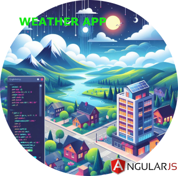

# angular-weather-app

Erstellen Sie eine Angular Webanwendung, die die Wetterdaten für eine vom Anwender definierten Ort anzeigt.



👉 ``Forke`` das Repository und löse die Aufgaben in einem ``Lösungsbranch`` 👈


# REST API
Die Wetterdaten sollen über folgenden Service angerufen werden: https://www.weatherapi.com

Der Service stellt einen Explorer bereit, über den die API getestet werden kann: https://www.weatherapi.com/api-explorer.aspx

Der API Key wird per E-Mail versendet.

# Fachliche Anforderungen
1. Der Anwender soll einen Ort eingeben können
2. Der Anwender soll ein konkretes Datum im Format `dd.MM.yyyy` eingeben können
3. Der Anwender soll die Wetterdaten für "Heute", für "Morgen" und für "Heute + 2 Tage" angezeigt bekommen

## Wetterdaten
Die Bezeichnung `Wetterdaten` meint folgende Werte:
- Name des Orts
- Name der Region
- Name des Landes
- Zeitzone
- Temperatur in C°
- Gefühlte Temperatur in C°
- Windgeschwindigkeit in Km/H
- Windrichtung
- Wolkenwahrscheinlichkeit in %
- Regenwahrscheinlichkeit in %

### Wetterdaten - Heute
Für den aktuellen Tag sollen dem Anwender die aktuellen Wetterdaten sowie Prognosedaten angezeigt werden.
Die Prognosedaten ergebensich aus den Wetterdaten, welche wie folgt zeitlich aggregiert werden:
  - Morgens (Durchschnittswerte von 06 - 12 Uhr)
  - Mittags (Durchschnittswerte von 12 - 18 Uhr)
  - Abends (Durchschnittswerte von 18 - 22 Uhr)
  - Nachts (Durchschnittswerte von 22 - 06 Uhr)

### Wetterdaten - Morgen | Heute + 2 Tage
Für diese beiden Varianten sollen wie in der Variante zuvor die Prognosedaten angezeigt werden.
Die Anzeige der aktuellen Wetterdaten entfallen hierbei.

## Darstellung
Für die Darstellung der Wetterdaten werden keine Anforderungen gestellt. Sie dürfen selbst entscheiden, wie die Daten dem Anwender angezeigt werden sollen. 

# Technische Anforderungen
- Für die Umsetzung der Webanwendung soll das Angular Framework genuzt werden.
- Funktionen sollen via Unit Tests getestet werden.
- Dependencies dürfen nach freiem Ermessen installiert und genutzt werden.

# Dokumentation
Für die Umsetzung bedarf es keiner eigenständigen Dokumentation. Jedoch soll der Code nach eigenem Ermessen mit Kommentaren versehen werden.

# Fragen & Probleme

Sollten sich Fragen ergeben oder Probleme auftreten, so versuchen Sie diese bestmöglich anzunehmen/lösen und zu dokumentieren, welche Entscheidungen und Voraussetzungen Sie getroffen haben.

# Interne Notiz
*kann ignoriert werden*

## Build build
````shell
docker build -t noderunner .
````

## Run app in container
````shell
docker run -v .:/app -p 4200:4200 -it noderunner bash
````

### in container start
````shell
npm install
ng serve
````
